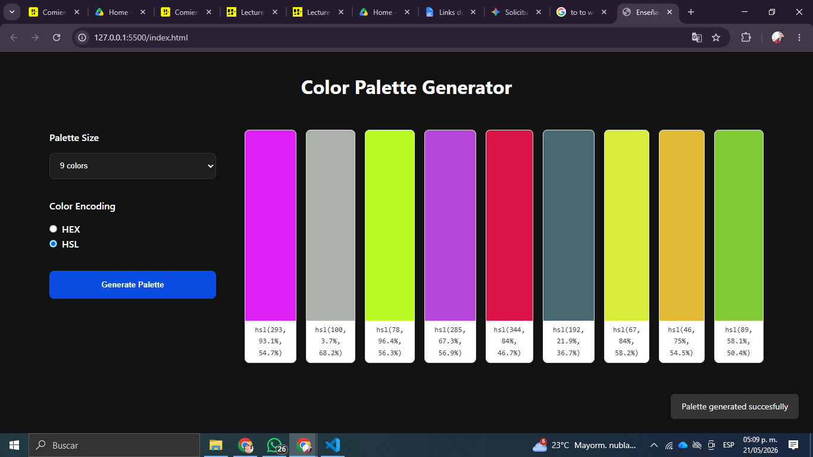

# Color Palette Generator
A web application that generates random color palettes and allows users to switch between HEX and HSL color formats with a single click.

## Summary
This project provides a simple and intuitive interface for designers and developers to generate random, harmonious color schemes. Users can customize the palette size and instantly copy color codes to their clipboard in their preferred format, streamlining the design workflow.

## Technical Stack
* **HTML5**: Semantic structure and form elements.
* **CSS3**: Flexbox layout, responsive design, and modern styling.
* **Vanilla JavaScript**: DOM manipulation, logic for color conversion (HEX to HSL), and Clipboard API integration.
* **Git/GitHub**: Version control and project hosting.

## Usage Instructions

### 1. Installation
Clone this repository to your local machine:
1. `git clone https://github.com/angelicalunagar/colorPalette-ProjectM1.git`
2. `cd colorPalette-ProjectM1`
3. Check README.md for instructions
4. `npm start` or open index.html

